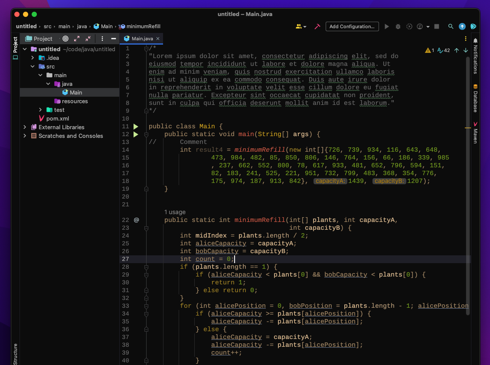

<!-- Plugin description -->
<h1 align="center">
  🎨 4Coder Casey JetBrains IDEs Theme
</h1>

    
    4Coder Casey is inspired by Casey Muratori's theme used in 4Coder by himself.
 Intellij IDEA

## 🚀 Build the Theme

1. Run the command `make` in the root of the project
2. You'll have the theme located in `./build/distributions`

## 🖌 Font

<table>
    <tr>
        <td>Font</td>
        <td><a href="https://www.fontsquirrel.com/fonts/liberation-mono" target="_blank">Liberation Mono</a></td>
    </tr>
    <tr>
        <td>Font Size</td>
        <td>15</td>
    </tr>
    <tr>
        <td>Line Spacing</td>
        <td>1</td>
    </tr>
</table>
<!-- Plugin description end -->